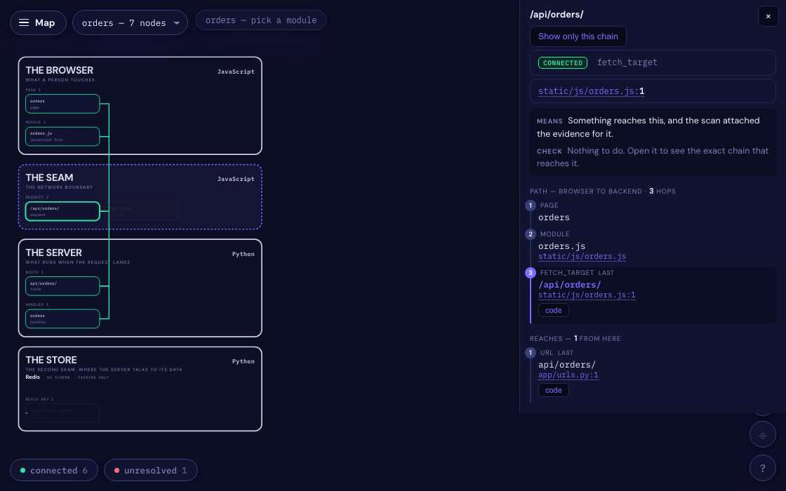
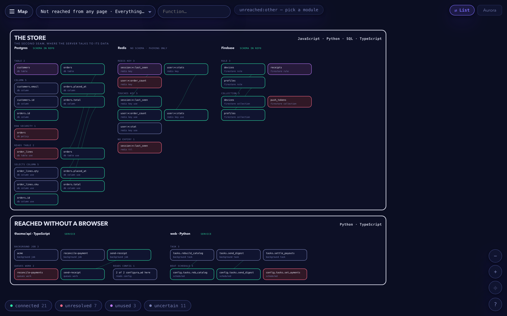
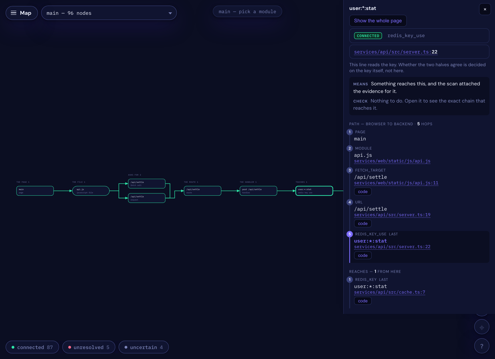
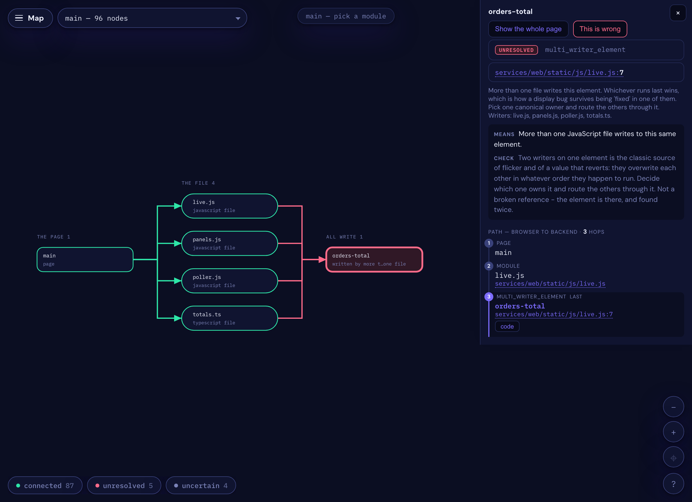

# Seamcheck

**Finds the bugs that sit between two things** — a request and the route meant to serve it,
a cache key written in one service and read in another, a job queued that no worker
consumes, an element four files are fighting over. Each side is valid on its own, which is
why nothing else catches them.

[](https://github.com/sponsors/dardameiz)
[](https://pypi.org/project/seamcheck/)
[](https://pypi.org/project/seamcheck/)
[](LICENSE)

```bash
pip install seamcheck && seamcheck map
```

It reads your source. It never runs your code, and it makes no network call — no API key,
no account, nothing to sign up for.

## Why I made it

I was building a game — a fairly large Django app with a lot of hand-written JavaScript —
and I kept losing afternoons to the same kind of bug. The Python was fine. The JavaScript
was fine. The route one asked for and the route the other served were one character apart,
and nothing I already had read both sides of that.

So I wrote something to find them, for myself, on that project. It kept catching things I
would not have found on my own, and after a while it seemed like other people might have
the same afternoons to lose. So here it is.

It does not catch everything, and I am sure there are things it gets wrong. When it cannot
tell, it tries to say `uncertain` rather than guess. **If you find it being confidently
wrong somewhere, please [open an issue](https://github.com/dardameiz/seamcheck/issues)** —
that is the most useful thing anyone can send me.

What changed, per release: [CHANGELOG.md](CHANGELOG.md).

## What it looks like



<sub>**The four tiers, and one chain through them.** A page and its module are the browser; the request it makes is the seam; the route and handler are the server; the key they read is the store. Nothing on this picture is inferred from a name — every hop on the right is a line of source the scan read. The second request in the seam is the unresolved one: it goes nowhere, and nothing else in the project would have said so.</sub>



<sub>**Three data stores and three services, one screen.** Postgres has a schema to check
against; Redis has none, so it can only ever show that two halves of your own code
disagree; Firebase has rules. Seven findings are visible before a card is read — a missing
row-security policy, a table nothing migrates, a Firestore collection with no rule, a cache
key with no expiry, and two renamed background jobs: one in Node, one in Django.</sub>



<sub>**Click a finding and follow it.** Five hops, browser to cache, with the direction on
the wires. This one ends on a Redis read in a TypeScript service, of a key a Python service
writes — one character apart. No compiler on either side spans that gap.</sub>



<sub>**Four files writing one element, in two languages.** The element is there, and found
four times. Whichever runs last wins, which is how a display bug survives being "fixed" in
one of them.</sub>


<sub>**One function, and what it costs.** Type three letters and pick `submit_push`: the
map draws everything that function touches - **following the calls**, because a handler
that delegates owns almost none of it itself - plus one hop out to what reaches it. The
line under the canvas counts the round-trips per call. This handler is meant to be
Redis-only, and it writes Postgres once. That is the whole diagnosis, and at thirty
thousand concurrent users it is the difference between a cache read and a connection out
of a pool of 45.</sub>

**A page, then its sections.** The map is not one drawing of the whole codebase — the
**Page** picker lists your HTML pages, and **Section** lists the *scripts* each one loads:
the code that actually runs from that script tag, followed through every import to the
selectors, URLs and keys it touches. A widget on a forty-module page is a section you can
open alone; **Whole page** is all of them at once. Whatever no page ever reaches sits in
the **Not reached from any page** buckets, which is a finding in itself.

**...and then the function.** The third picker is the one you reach for while you are
writing code: start typing and every function in the project is offered, prefix first.
Picking one leaves the pages behind entirely - a function's symbols are never all on one
page, since the page holds its route, the store layer holds its keys, and whatever nothing
reaches sits in a bucket - and draws its own world instead: what it touches, what its
helpers touch, and one hop out to whatever reaches those. **Called by** lists everything
that calls it, each one a click. Building something new, the holes are the drawing: an
unresolved request means the backend is not there yet, an unused route means the frontend
is not calling it yet, a key written and never read means nobody consumes it.
[More on reading the map →](docs/the-map.md)

## The four words

Every symbol gets exactly one. Nothing is counted twice, and nothing is dropped:

| | |
|---|---|
| **connected** | Something reaches it, and the evidence is attached. |
| **unresolved** | Something reaches for it by name and it is not there. Usually a bug. |
| **unused** | Both ends are visible and nothing connects them. Usually a decision. |
| **uncertain** | No evidence either way. **Never a claim that it is dead.** |

`uncertain` is the important one. A route assembled at runtime genuinely cannot be known by
reading source, and I would rather it said so than guessed. Every `uncertain` names the
evidence it is missing.

**Two numbers, two different denominators**, and quoting one as if it were the other is the
mistake this page used to make:

- **Coverage** — verdicts ÷ symbols. *How much of my project can it speak to at all?*
- **Precision** — true claims ÷ claims. *When it says something is broken, is it right?*

**Precision says nothing about `uncertain`, because `uncertain` is not a claim.** A backend
answering `uncertain` to everything would score flawless precision and be useless.

### Turning `uncertain` into evidence

Some of it can never be settled by reading source. A selector assembled from a variable, a
URL concatenated at call time — no reader resolves those, and that is the floor of what
static analysis can know. **The browser knows, though.**

```bash
pip install 'seamcheck[observe]'
seamcheck observe          # visit the pages the graph knows about
```

It drives your running app with a probe installed ahead of the app's own scripts, and
records **every selector actually queried and whether it found anything**, every URL
actually requested, and every class actually applied. That evidence is keyed to the commit,
and it converts `uncertain` rows into answers instead of guesses.

With one caveat it states rather than hides: **a page the run never visited leaves no trace,
and looks exactly like a page that is broken.** So everything it promotes is labelled as
observed, and `uncertain` going down is always traceable to a specific run over specific
pages. The goal was never a smaller number — it is a number backed by something.

## Where it stands

Measured across 47 open-source projects, regenerated by `python tools/coverage.py`:

| backend | repos | symbols | judged | **coverage** | ceiling |
|---|---:|---:|---:|---:|---:|
| **Flask** | 5 | 9,257 | 8,508 | **91%** | 93% |
| **Django** | 21 | 113,946 | 94,586 | **83%** | 92% |
| **FastAPI** | 5 | 4,754 | 2,663 | **56%** | 56% |
| **Express** | 6 | 2,529 | 1,162 | **45%** | 46% |
| **Next.js** | 6 | 2,968 | 1,071 | **36%** | 36% |
| **NestJS** | 4 | 2,727 | 898 | **32%** | 32% |
| **all** | **47** | **136,181** | **108,888** | **79%** | 87% |

*Ceiling* is where coverage would land if every missing reader were written; the gap between
the two columns is the to-do list, and everything below the ceiling is evidence that is not
in the repository at all.

**Django is the one being finished first**, deliberately — it is used every day against a
large production codebase, so a wrong finding gets noticed the same afternoon. The other
backends are real and improving; none are going away. Precision is **45%** on hand-labelled
findings, up from 28%, and that number moves because people tell me what it got wrong.

Detail: [coverage per backend](docs/coverage.md) · [what it has actually found](docs/field-notes.md)

## In CI

```bash
seamcheck check --since $BASE_SHA
```

Exit `1` on new findings, `0` when clean. **`--since` is what makes it adoptable**: it fails
only on what your branch added, so you can turn it on today against a codebase with three
thousand open findings and it will pass. No token, no network, no model — nothing per run
and nothing per repository.

## More

[Install, per OS](docs/install.md) · [Reading the map](docs/the-map.md) ·
[The commands](docs/commands.md) · [The data layer](docs/data-layer.md) ·
[Using it from an agent](docs/agents.md) · [Telling me it got something wrong](docs/reporting.md)

**How it differs from Knip and depcheck:** they work inside one language's module graph —
unused files, exports, dependencies — and do it well. This looks at the boundaries *between*
languages. Not competitors; on a TypeScript codebase, running both is reasonable.

## Contributing

Issues and pull requests welcome — [CONTRIBUTING.md](CONTRIBUTING.md). The most useful thing
anyone can send is a finding that is wrong, and why.

## License

MIT. Take it, fork it, improve it.
