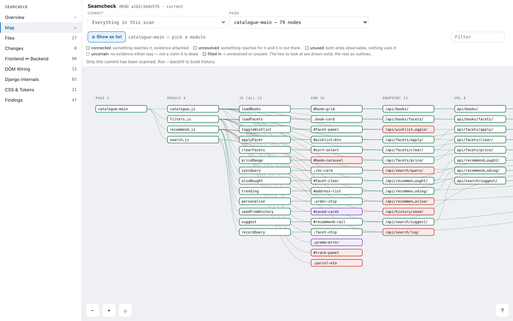
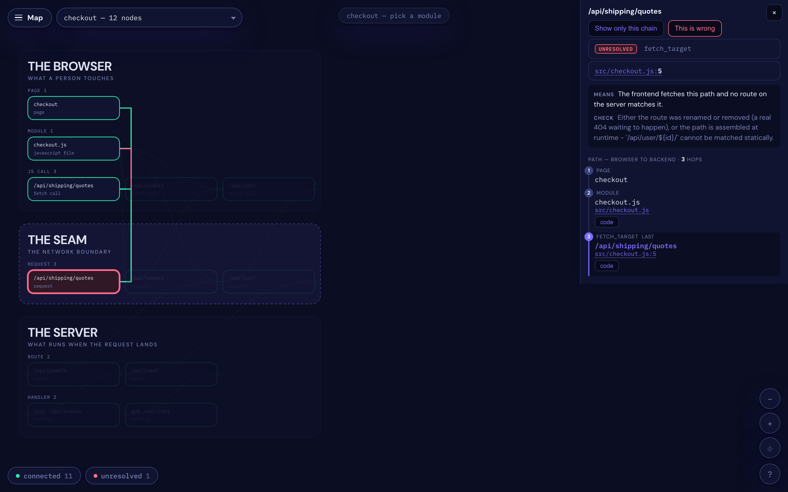
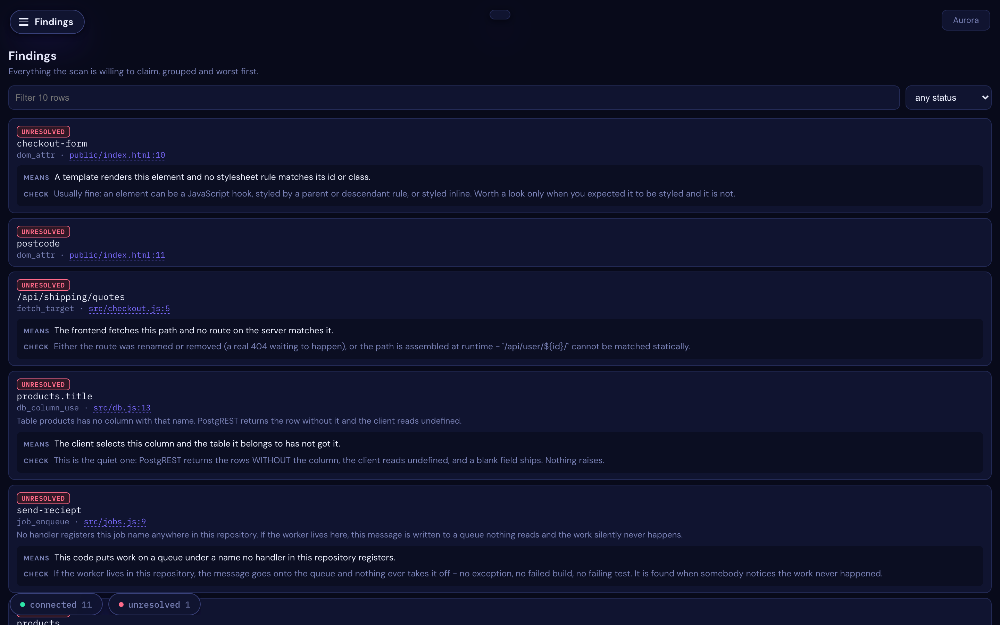
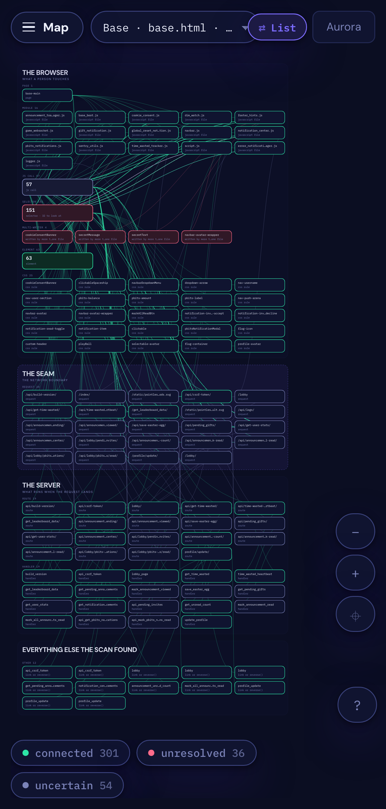
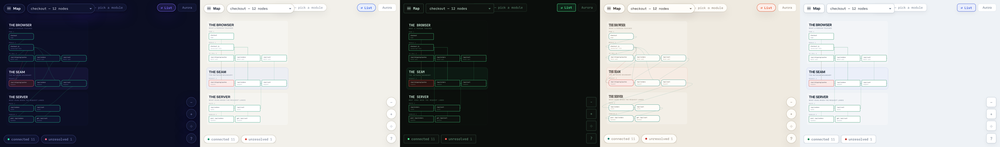

# Seamcheck

[](https://github.com/sponsors/dardameiz)
[](https://pypi.org/project/seamcheck/)
[](https://pypi.org/project/seamcheck/)
[](LICENSE)

A small tool that looks for the bugs that sit **between** your frontend and your backend.
It reads your source. It never runs your code.



## Why I made it

I was building a game — a fairly large Django app with a lot of hand-written JavaScript —
and I kept losing afternoons to the same kind of bug. The Python was fine. The JavaScript
was fine. The route one asked for and the route the other served were one character apart,
and nothing I already had read both sides of that.

So I wrote something to find them, for myself, on that project. It kept catching things I
would not have found on my own, and after a while it seemed like other people might have
the same afternoons to lose. So here it is.

It does not catch everything, and I am sure there are things it gets wrong. When it cannot
tell, it tries to say `uncertain` rather than guess. **If you find it being confidently
wrong somewhere, please [open an issue](https://github.com/dardameiz/seamcheck/issues)** —
that is the most useful thing anyone can send me.

## Install

Seamcheck reads a Django project **by importing it**, so install it into the same
virtualenv your project runs in.

```bash
source .venv/bin/activate        # your project's virtualenv
pip install seamcheck
seamcheck map
```

That is the whole setup. It opens a map of your project and prints a link you can open on
your phone. **Have a look around before reading any further** — it explains itself better
than this page does.

Needs **Python 3.10 or newer**.

<details>
<summary><b>If pip says <code>externally-managed-environment</code></b></summary>

That is [PEP 668](https://peps.python.org/pep-0668/). Homebrew's Python and most Linux
distro Pythons refuse to let pip install into them globally, on purpose — it is how you
break your OS. A virtualenv is the answer, and it is what you want here anyway:

```bash
python3.12 -m venv .venv
source .venv/bin/activate
pip install seamcheck
```

Do not reach for `--break-system-packages`. It does what it says.
</details>

<details>
<summary><b>macOS</b></summary>

The `python3` that ships with macOS is **3.9**, which is too old — and it is why
`pip3 install seamcheck` can report *"could not find a version that satisfies the
requirement seamcheck (from versions: none)"*. That message means "nothing here matches
your Python", not "no such package".

```bash
brew install python@3.12
cd your-project
python3.12 -m venv .venv
source .venv/bin/activate
pip install seamcheck
```
</details>

<details>
<summary><b>Debian / Ubuntu</b></summary>

```bash
sudo apt install python3-venv        # if `python3 -m venv` is missing
python3 -m venv .venv
source .venv/bin/activate
pip install seamcheck
```
</details>

<details>
<summary><b>Windows</b></summary>

```powershell
py -3.12 -m venv .venv
.venv\Scripts\activate
pip install seamcheck
```
</details>

<details>
<summary><b>pipx and <code>uv tool</code> — read this before you use them</b></summary>

Both work and both give you `seamcheck` on your PATH everywhere:

```bash
pipx install seamcheck
uv tool install seamcheck        # uv fetches its own Python, so no Homebrew needed
```

**But a pipx or uv-tool copy is isolated from your project on purpose, so it cannot scan a
Django project** — importing your settings needs your project's own dependencies, and they
are not in there. Seamcheck will say so rather than showing you a traceback.

They are fine for repos where nothing has to be imported: Express, NestJS, Next.js,
Fastify.
</details>

<details>
<summary><b>Upgrading and getting an old version</b></summary>

pip caches the package index, so shortly after a release you can be handed the previous
one:

```bash
pip install --no-cache-dir --upgrade seamcheck
seamcheck --version
```
</details>

## What it looks like

Click any node and it lights the chain that reaches it — hop by hop, with the file and line
for each.



Everything it is willing to claim, each one explained in a sentence, worst first.



It reads on a phone, because that is where you end up looking at it.



Five looks, if you care. Aurora is the default.



## Does it work with my stack?

**Django, today, from the command line.** No configuration — it finds your project and
reads it.

**FastAPI · Flask · Express · Fastify · NestJS · Next.js** — the readers for these are
built and tested against real repositories, and they find 2,435 routes across the 20
open-source projects in the corpus. But `seamcheck` still needs a Django project to start
from, so on the command line they are **not reachable yet**. They work through the Python
API. Removing that gate is the next thing I am doing, and until it lands I would rather say
so here than let the list imply otherwise.

**Frontends** — plain JavaScript · TypeScript · Django templates · CSS and design tokens
**Also reads** — Stripe webhooks · Celery tasks and beat schedules · GraphQL schemas

Tried against 20 open-source projects so far: 53,361 files, 9.5M lines. If yours does not
work, I would genuinely like to know.

## Four words, and it never says more than it can prove

| | |
|---|---|
| **connected** | Something reaches it, and the evidence is attached. |
| **unresolved** | Something reaches for it by name and it is not there. Usually a bug. |
| **unused** | Both ends are visible and nothing connects them. Usually a decision. |
| **uncertain** | The scan cannot tell. |

`uncertain` is a real answer rather than a cop-out. A route assembled at runtime genuinely
cannot be known by reading the source, and I would rather it admitted that than pretended
otherwise. It is also why the other three can be trusted.

## If you build with an AI agent

This is where I have found it most useful, honestly. Asked *who writes this element?*, an
agent tends to grep, read a handful of files, and make a reasonable guess. On a big repo
that costs a lot of context and is still a guess.

And there is a failure I have run into more than once: asked to fix something on screen, an
agent will sometimes add a **second** place that writes the same element rather than finding
the one already there. The symptom moves, the next session adds another, and it slowly gets
worse.

So there is an MCP server. The agent can just ask, and gets the answer with the exact lines.

```bash
claude mcp add seamcheck -- seamcheck-mcp
```

Tools: `check`, `explain`, `triage`, `report`.

## In CI, if you want it there

```bash
seamcheck check --since $BASE_SHA
```

Exit 1 on new findings, 2 if there is no baseline yet, 0 when clean. It also writes a
markdown digest you can post as a PR comment with `--format markdown`.

## What it cannot see

Routes built at runtime from variables. Elements a framework renders from components rather
than templates — React and Vue handlers are props, not listeners, and the trail stops at the
module boundary. Anything reached only by a string the scan cannot resolve.

It says `uncertain` in all of those cases instead of guessing.

## Contributing

Issues and pull requests welcome, especially "it got this wrong and here is the file".

## License

MIT. Take it, fork it, improve it.

---

<sub>A note on the copy: the wording on this page was drafted with an LLM, and partly *for*
them — realistically a coding agent is going to read this README before a person does, and
decide whether to install it. So it is written to be easy to parse as well as to read. The
tool itself does the opposite: it will not tell you anything without showing you the line it
came from.</sub>
