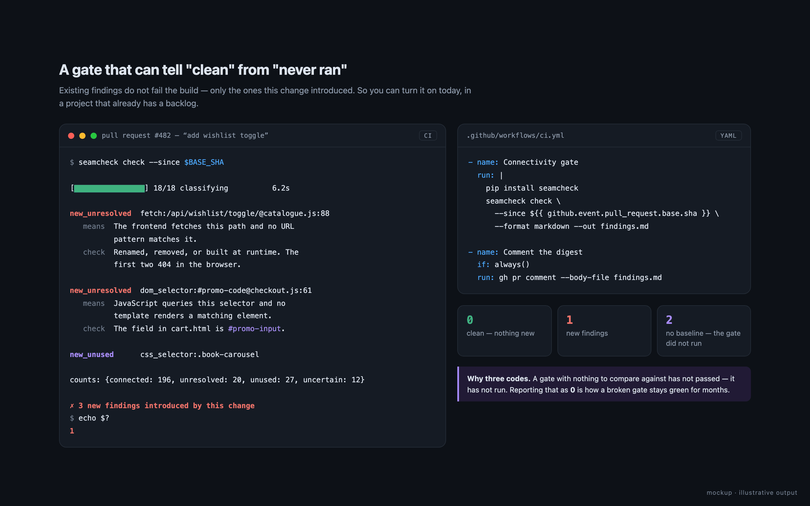
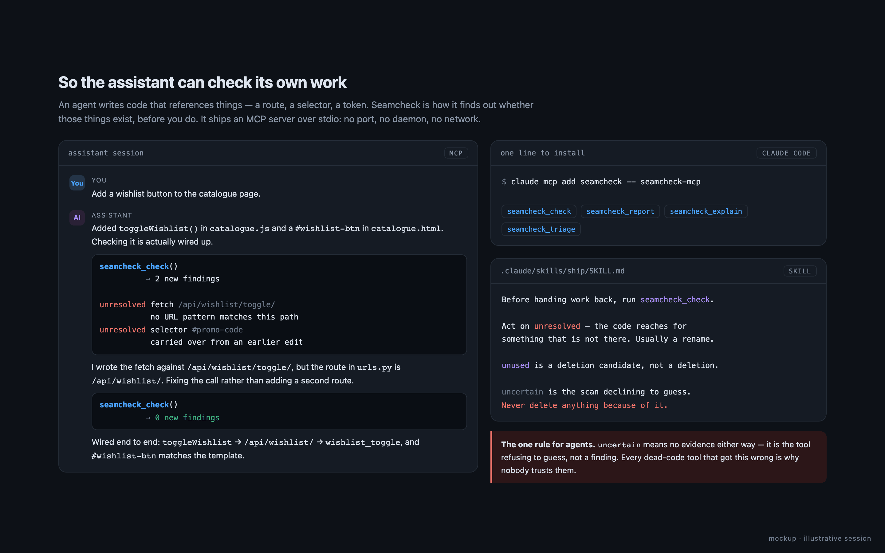

# Seamcheck

[](https://github.com/sponsors/dardameiz)
[](https://pypi.org/project/seamcheck/)
[](LICENSE)

**Your AI wrote 400 lines. Which of them are actually wired to anything?**

Seamcheck reads a Django + JavaScript project and tells you what connects to what — which
`fetch()` lands on which view, which template element the JS is reaching for, which CSS
rule nothing has referenced since 2023. Then it tells you what it *couldn't* work out,
which turns out to be the part that matters.

No SaaS. No upload. One command, one HTML file, and an exit code for CI.

```bash
pip install seamcheck
seamcheck map
```


## The four answers

Every dead-code tool ever written has told you something was unused and been wrong, and
you stopped trusting it. Seamcheck has a fourth answer:

| | |
|---|---|
| `connected` | something reaches this — here's the file and line |
| `unresolved` | something reaches for this and it isn't there |
| `unused` | both ends are observable and nothing uses it |
| **`uncertain`** | **no evidence either way. Not a claim it's dead.** |

That last row is the whole product. A page reached by an `<a href>` looks exactly like a
dead one if you only parse `fetch()` calls. Seamcheck says so instead of guessing. On a
700-URL project that's the difference between a report you act on and 668 lies.

It also reports **its own coverage** — how much of each file it actually reasoned about.
No other tool I've found will tell you where it wasn't looking.

## Click a red one and it shows you the whole chain

Every finding is a path, and the path is the explanation. Click a node and everything else
recedes: the line through it lights up, each hop numbered browser-first, each with the real
source behind it and the file:line that opens in your editor.


That one is real, and it is the class of bug this exists for: the JS fetches
`/api/wishlist/toggle/`, the URLconf serves `/api/wishlist/`, and nothing fails until a
user clicks the button. No test covers it, because there is nothing to test — the code is
syntactically perfect and points at nothing.

Every row says **what the scan observed** and **what is usually actually true**, because
`unresolved · css_token_use · button_badges.css:3` is precise and tells a newcomer
nothing. Often the first explanation offered is "this is fine, and here is why the scan
can't tell."


## What it found in the project it was built on

Not hypotheticals. Real bugs, in a 511,000-line Django codebase, found while writing this:

- Five CSS custom properties in a **loaded** stylesheet that resolve to nothing —
  `--text-primary`, `--border-color` and friends. Those declarations render nothing today.
- An endpoint reported missing that turned out to be **`<str:division_id>` matching a
  deliberate `'all'` sentinel** — so I fixed the matcher instead of "fixing" the code.
- 65 API routes whose path appears in no source file at all.
- 46 DOM elements written by more than one module — the reason a display bug survives
  being "fixed" in one of them.

## Numbers you can read

A count with no denominator is not a result: "1,319 unresolved" reads as a catastrophe or
as nothing at all depending on whether the project has two thousand symbols or forty
thousand.


## For CI

```bash
seamcheck check --since $BASE_SHA
```

Existing findings do not fail the build — only the ones this change introduced — so you
can turn it on today, in a project that already has a backlog.



`1` = new findings. `2` = no baseline, so the gate didn't run. `0` = clean. That
distinction matters: a gate that never ran is not a gate that passed.

## For agents

Seamcheck ships an MCP server, so your assistant can check its own work before it hands it
to you. It speaks over stdin/stdout — no port, no daemon, no network.



```bash
claude mcp add seamcheck -- seamcheck-mcp
```

**Cursor, Windsurf, Claude Desktop** — in the MCP config:

```json
{
  "mcpServers": {
    "seamcheck": {
      "command": "seamcheck-mcp",
      "cwd": "/path/to/your/django/project"
    }
  }
}
```

`cwd` matters: Seamcheck reads a real project, so it needs to start in one. It finds the
settings module the same way the CLI does — the nearest `manage.py`.

Four tools: `seamcheck_check` (scan, report findings new since the last snapshot),
`seamcheck_report` (the digest), `seamcheck_explain` (one symbol with its evidence), and
`seamcheck_triage` (record a disposition).

There is also an [`AGENTS.md`](seamcheck/AGENTS.md) with the one rule that matters:
**never delete something because it came back `uncertain`.** That is the scan saying it
has no evidence, not that the code is dead.

## Install

```bash
pip install seamcheck
```

One thing in `settings.py`:

```python
INSTALLED_APPS = [..., "seamcheck"]
```

That's it. **Seamcheck works the rest out from your project** — Django already knows where
its URLconf, its ASGI application, its templates, its apps and its static dirs are, so
asking `settings` and the app registry is exact rather than a guess. Check what it resolved
to before you trust a report:

```bash
seamcheck config
```

```
  templates_root  myapp/templates
                  └─ settings.TEMPLATES (158 templates; 1 other dir(s) not scanned)
  urlconf_module  myproject.urls
                  └─ settings.ROOT_URLCONF
```

Override anything you disagree with, key by key — what you write always wins:

```python
SEAMCHECK_CONFIG = {
    "templates_root": "myapp/templates",
    # Makes every file:line in the UI open at that line.
    # vscode (default) · cursor · windsurf · zed · sublime · pycharm · idea · webstorm · none
    "editor": "cursor",
}
```

Detection deliberately errs **wide**. The one config bug found while validating this
against a real project was a CSS root set narrow enough to exclude the admin stylesheets
while the admin templates were still being scanned — and that asymmetry invented **185
findings out of working CSS**. A root that's too broad costs a slower scan; one that's too
narrow reports bugs that aren't there. `node_modules`, `venv`, `dist` and `collectstatic`
output are always excluded — a bundler's output is a *copy* of the source, so scanning it
doubles every symbol and then reports the copies as unreferenced.

<details><summary>The rest of the keys</summary>

| key | what it is | default |
|---|---|---|
| `static_root` | where a template's `` resolves from | `static` |
| `vite_config` | the bundler config, read for entry points | `vite.config.js` |
| `asgi_module` | scanned for WebSocket and ASGI routes | none |
| `app_configs` | apps whose models are pulled into the graph | none |
| `tailwind_build_output` | built CSS, so utility classes aren't read as dead | none |
| `map_output` | where `seamcheck map` writes | `docs/maps/connectivity-map.html` |
| `report_output` | where `--format html` writes | `docs/maps/connectivity-report.html` |
| `editor` | URL scheme for the clickable locations | `vscode` |

</details>

**You need Node on PATH.** The JS and CSS parsers run on it. You do *not* need npm or
`node_modules` — acorn and postcss ship inlined in the wheel. If Node is missing,
Seamcheck says so and gives you the Python half rather than dying.

## Use

```bash
seamcheck map               # scan, then open the UI. Start here.
seamcheck check             # exit 1 on new findings. This is the CI one.
seamcheck backfill          # give the map some commit history

seamcheck help              # all nine commands
seamcheck help map          # what one is for, with worked examples
seamcheck scan              # the totals, no UI, no server
seamcheck explain <id>      # one symbol, with the code around it
```

`seamcheck map` scans, writes the UI to a file, and then **serves that file** so you get a
link you can click:

```
  wrote  docs/maps/connectivity-map.html  (9.3 MB)

  open   http://127.0.0.1:49497/SW9FfTR4XybG
  phone  http://192.168.1.38:49497/SW9FfTR4XybG

  Ctrl-C to stop.
```

Two links because they answer different questions: the first is the one to click here, the
second is the one to type on a phone on the same wifi. It serves rather than printing a
`file://` path because a `file://` link is not much of a link — VS Code's terminal opens it
*inside VS Code*, and a phone can't use it at all.

Nothing is uploaded. While it runs, anyone on your network holding the link can read the
report; `--local-only` binds loopback instead and drops the phone link, `--tunnel` goes the
other way and opens a temporary public HTTPS address. `--no-serve` writes the file and
stops, which is what CI wants.

A scan takes half a minute on a large project, so it draws a progress bar — on **stderr**,
and only when that is a terminal. `seamcheck json > graph.json` gives you JSON and nothing
else; a CI log collects no carriage returns.

| | |
|---|---|
| `-v`, `--verbose` | show the host project's own warnings and start-up logging. Importing a real Django project prints a screenful before Seamcheck says anything; that noise is off by default, and `ERROR` always gets through either way. |
| `-q`, `--quiet` | no progress bar |

Anything after `--` goes straight to the management command: `seamcheck map -- --help`
lists every flag it accepts.

It finds your project by walking up to the nearest `manage.py` and reading the settings
module out of it, so it works from anywhere inside the tree. Everything is also available
as `python manage.py seamcheck ...` if you prefer — same code, one implementation.

### The UI

One file, no network, opens on a phone. Columns run left to right in the order a request
travels — page → module → `fetch()` → endpoint → URL → view → response field — so the axis
you read along *is* the frontend-to-backend seam.

Every `file:line` in it is a link: click to open that line in your editor, shift-click to
copy the absolute path.

**Files** is your actual folder tree, with a bar per file showing how much of it Seamcheck
reasoned about — because "no findings" and "never looked" are not the same sentence. Click
a file to draw its symbols on the map.

**And the 90% no page reaches.** The map is rooted at page entry points, so models, signal
receivers, admin actions, routes nothing fetches and template elements no JS selects are
reached by that graph only sometimes. They get pages of their own rather than being absent:
*Django-side — reached by Django, not by a page*, *stylesheet rules nothing matched*, and so
on. Being unreached is not a finding — Django reaches a model, a webhook reaches a route —
so every symbol keeps its own status and the bucket says why it is a bucket.

### Per-commit

```bash
seamcheck backfill          # the last 20 commits
seamcheck backfill 100      # ...or as many as you like
```

Now the map has a commit picker. Pick one and see what *that commit* changed — added,
removed, status flipped — including things it deleted, which no longer exist to be drawn
and get named instead.

### From your phone

```bash
seamcheck map              # the link, and the phone link
seamcheck map --tunnel     # ...reachable from anywhere
```

Nothing is uploaded. The server is a socket on your machine that dies with the command, and
the URL carries a random token so nothing on your network stumbles into it.

## What it can't do

Written down because a tool that hides its blind spots is worse than no tool:

- **Django + vanilla JS.** No React, Vue, or TypeScript yet.
- **Celery, Redis, WebSockets and Stripe aren't traced.** Anything reached only through
  those is invisible, and the UI says so rather than showing a confident zero.
- **A URL built at runtime** stays `uncertain`. The prefix is recorded, never a guess.
- **It has been measured against one real project** — a 511,000-line Django app. That's one
  more than most tools at this stage and far fewer than you'd want; a corpus of public repos
  is the next job. See [How accurate is it?](#how-accurate-is-it) for what the one
  measurement actually says.

## How accurate is it?

Measured on one real Django + vanilla-JS app: **511,000 lines across 1,505 files** — 376 URL
routes, 328 views, 267 templates, 283 JavaScript modules, 161 stylesheets. Seamcheck reads
that as **38,010 symbols** (a symbol is one named thing: a route, a function, a selector, a
design token).

Every one of the **1,455 findings** it reported was hand-assigned a root cause — no
sampling, nothing left as "probably fine". The first pass came out at **~73% precision**,
which is the number most tools in this space never publish because nobody measures it.

Then the four causes of the other 27% got fixed:

| cause | findings | fixed |
|---|---|---|
| A CSS root set too narrow to see the stylesheets | 185 | config detection now errs wide |
| Inline `<script>` never read for DOM queries | 148 | now parsed, batched |
| Interpolated classes reported as literal prefixes | 38 | dropped as fragments |
| `getPropertyValue` not counted as a use | 1 | now counted |

**1,455 findings → 1,153. Precision ~73% → ~97%.** Measured the same way, twice.

Per category, after: `css_token_use` **100%** · `dom_selector` **98%** · `css_token_def`
**97%** · `dom_attr` **93%**.

Two things that number does *not* mean. It's one project — a corpus is the next job. And
"precision" here is "the finding describes something real about the code", not "you must
act on it": an unstyled, unscripted element is a true observation and a low-priority one.

## Support

Seamcheck is free, MIT, and has no company behind it. If it found you something,
[**sponsor it on GitHub**](https://github.com/sponsors/dardameiz) — GitHub takes no cut,
and it is the single clearest signal that this is worth continuing.

Not sponsoring is completely fine. Opening an issue with a finding it got wrong is worth
more than money, and there are two templates for exactly that:
[a false finding](https://github.com/dardameiz/seamcheck/issues/new?template=false_finding.yml)
and [one it missed](https://github.com/dardameiz/seamcheck/issues/new?template=missed_finding.yml).

## Contributing

Issues and PRs welcome. One house rule, and it's the reason the tool is worth anything:
**never make a claim the scan can't evidence.** If you can't prove it, it's `uncertain`,
and the note says which evidence source was missing.

The screenshots above are generated, not pasted: `python docs/mockups/capture.py` renders
the real UI against a fictional bookshop in `docs/mockups/demo_graph.py`. The two dark
panels are hand-built mockups and say so in their own corner.

## License

MIT.
