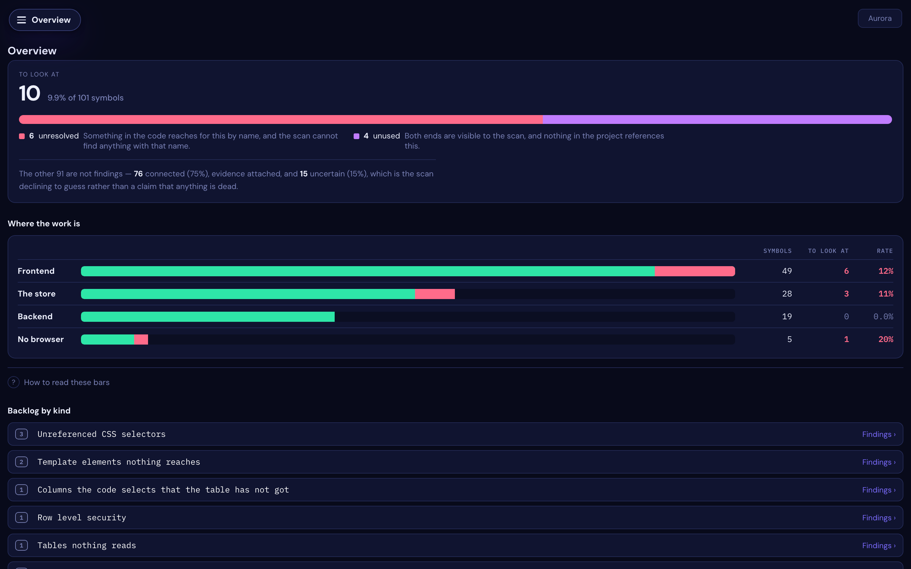
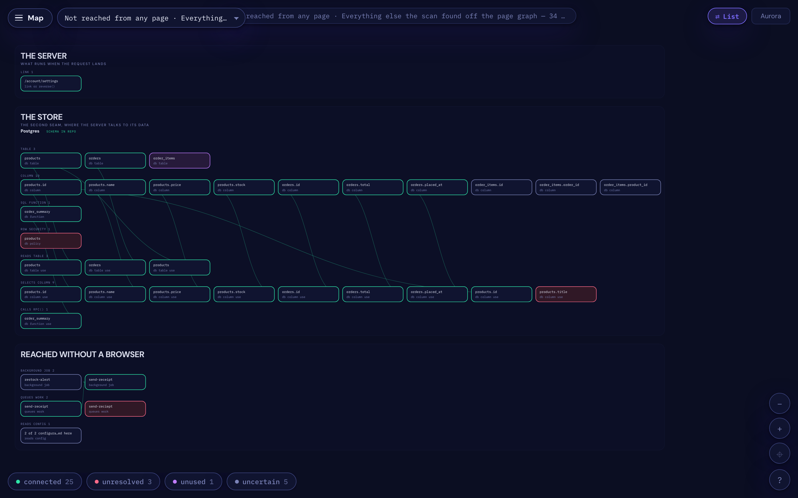
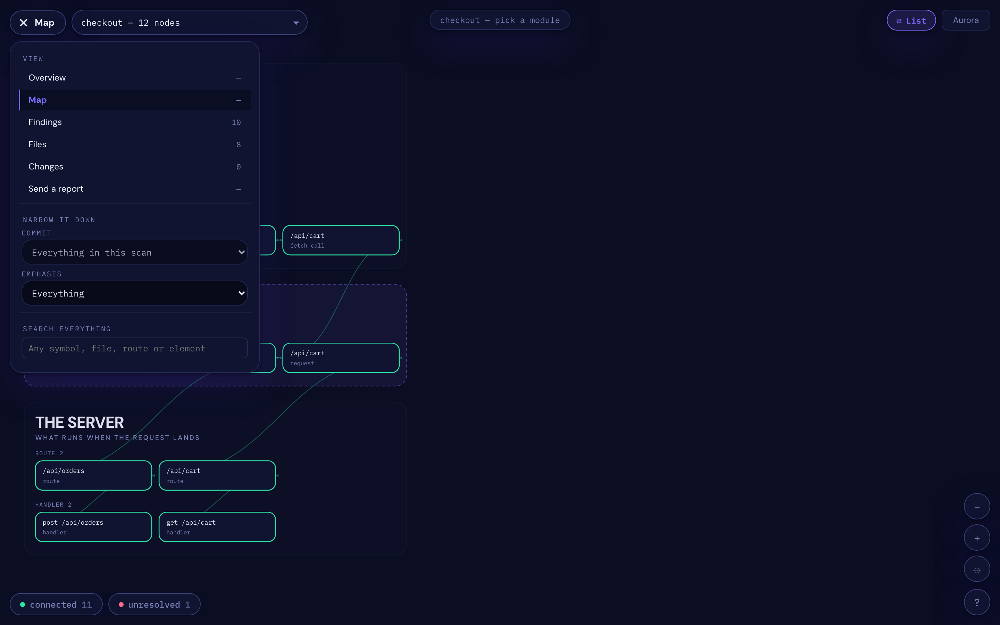

# Seamcheck — find the bugs between your frontend and your backend

**Cross-language static analysis for Django, Express, FastAPI, Flask, NestJS, Next.js and
Fastify.** Finds dead CSS classes, unused template attributes, `fetch()` calls to routes
that do not exist, Redis keys written under one name and read under another, and Stripe
events nothing handles. Reads your source; never runs your code; no API key, no network.

[](https://github.com/sponsors/dardameiz)
[](https://pypi.org/project/seamcheck/)
[](https://pypi.org/project/seamcheck/)
[](LICENSE)

```bash
pip install seamcheck && seamcheck map
```


<sub>A small Express shop, scanned. Read it downwards: **the browser** at the top, **the
seam** where requests cross the network, **the server** underneath, and **the store** where
it talks to its data. **Red is a request with nothing at the other end.**</sub>

## The bugs it is looking for

None of these throw. Nothing fails a test. That is exactly why they survive:

| | |
|---|---|
| **A `fetch()` to a route that does not exist** | someone renamed `/api/orders` to `/api/order` and the caller is one character behind |
| **A CSS class nothing defines** | the rule was deleted; three templates still ask for it, and the element renders unstyled |
| **A template attribute nothing writes** | `data-modal-level-name` sits in the HTML, the function that filled it is gone, and the value has been frozen since it shipped |
| **Two writers for one element** | two managers set the same counter to different values, so it flickers between them |
| **A Redis key with a typo** | written as `user:{id}:stats`, read as `user:{id}:stat`, and the read just returns nothing, quietly, for a year |
| **A Stripe event nothing handles** | your code calls an API that makes Stripe send `invoice.paid`, and no handler exists |


<sub>**The red list is the point.** Every finding names the file and line on both sides of
the seam, and says which evidence it has.</sub>

## Why I made it

I was building a game — a fairly large Django app with a lot of hand-written JavaScript —
and I kept losing afternoons to the same kind of bug. The Python was fine. The JavaScript
was fine. The route one asked for and the route the other served were one character apart,
and nothing I already had read both sides of that.

So I wrote something to find them, for myself, on that project. It kept catching things I
would not have found on my own, and after a while it seemed like other people might have
the same afternoons to lose. So here it is.

It does not catch everything, and I am sure there are things it gets wrong. When it cannot
tell, it tries to say `uncertain` rather than guess. **If you find it being confidently
wrong somewhere, please [open an issue](https://github.com/dardameiz/seamcheck/issues)** —
that is the most useful thing anyone can send me.

What changed, per release: [CHANGELOG.md](CHANGELOG.md).

## Install

```bash
pip install seamcheck
seamcheck map
```

That is the whole setup. It opens a map of your project and prints a link you can open on
your phone. **Have a look around before reading any further** — it explains itself better
than this page does.

Needs **Python 3.10 or newer**, and nothing else.

**If your project is Django**, put it in the project's own virtualenv:

```bash
source .venv/bin/activate
pip install seamcheck
```

A Django project is the one thing seamcheck reads by *importing* it, so it has to run where
that project's imports resolve. Every other backend is read from source, so anywhere works.

For the agent server: `pip install 'seamcheck[mcp]'`.

<details>
<summary><b>If pip says <code>externally-managed-environment</code></b></summary>

That is [PEP 668](https://peps.python.org/pep-0668/). Homebrew's Python and most Linux
distro Pythons refuse to let pip install into them globally, on purpose — it is how you
break your OS. A virtualenv is the answer, and it is what you want here anyway:

```bash
python3.12 -m venv .venv
source .venv/bin/activate
pip install seamcheck
```

Do not reach for `--break-system-packages`. It does what it says.
</details>

<details>
<summary><b>macOS</b></summary>

The `python3` that ships with macOS is **3.9**, which is too old — and it is why
`pip3 install seamcheck` can report *"could not find a version that satisfies the
requirement seamcheck (from versions: none)"*. That message means "nothing here matches
your Python", not "no such package".

```bash
brew install python@3.12
cd your-project
python3.12 -m venv .venv
source .venv/bin/activate
pip install seamcheck
```
</details>

<details>
<summary><b>Debian / Ubuntu</b></summary>

```bash
sudo apt install python3-venv        # if `python3 -m venv` is missing
python3 -m venv .venv
source .venv/bin/activate
pip install seamcheck
```
</details>

<details>
<summary><b>Windows</b></summary>

```powershell
py -3.12 -m venv .venv
.venv\Scripts\activate
pip install seamcheck
```
</details>

<details>
<summary><b>pipx and <code>uv tool</code> — read this before you use them</b></summary>

Both work and both give you `seamcheck` on your PATH everywhere:

```bash
pipx install seamcheck
uv tool install seamcheck        # uv fetches its own Python, so no Homebrew needed
```

**But a pipx or uv-tool copy is isolated from your project on purpose, so it cannot scan a
Django project** — importing your settings needs your project's own dependencies, and they
are not in there. Seamcheck will say so rather than showing you a traceback.

They are fine for everything else, since nothing there has to be imported: Express,
Fastify, NestJS, Next.js, Flask, FastAPI, and Supabase, Firebase or Redis projects.
</details>

<details>
<summary><b>Upgrading and getting an old version</b></summary>

pip caches the package index, so shortly after a release you can be handed the previous
one:

```bash
pip install --no-cache-dir --upgrade seamcheck
seamcheck --version
```
</details>

## How it compares to Knip, depcheck and ESLint

Worth being clear, because it is the first thing a JavaScript developer will ask. **Knip
and its neighbours work inside one language's module graph** — unused files, unused
exports, unused dependencies — and they do it very well. Frontend or backend does not come
into it; if your server is TypeScript, Knip already covers it.

**Seamcheck looks at the boundaries between languages instead.** A template referencing a
CSS class no stylesheet defines. A `fetch()` naming a route the Python never registered. A
Redis key written under one name and read under another. A Stripe event dispatched on that
Stripe will never send. Those are invisible to a module graph, because each side is
individually valid.

They are not competitors, and on a TypeScript codebase running both is reasonable. If what
you actually want is unused JavaScript exports, use Knip — it is better at that than this
will be.

## What it looks like

**Click a red one.** The chain that reaches it lights up and everything else recedes, so
you can see where the request came from and where it stopped — with the file and line for
every hop, and a sentence saying what it means and what to check.


<sub>`checkout.js` asks for `/api/shipping/quotes`. The server serves
`/api/shipping/quote`. One character, valid on both sides, and nothing else would have told
you. The lit line runs straight and carries an arrow, so the direction is the request's
direction; everything not on the path recedes.</sub>

The number it opens on is the only one that matters: **how much is worth looking at**, and
what the rest of the scan is instead.



<sub>Ten of 101 symbols are findings. The other 91 are named rather than hidden — 76
connected with evidence attached, 15 uncertain, which is the scan declining to guess. Each
region carries its own rate, so "the store is 11% findings" is a sentence you can act on
and "the frontend is bigger" is not.</sub>

It reads your data layer as the **second seam** — a query crosses a boundary and lands on a
table the same way a request crosses one and lands on a route.



<sub>Lanes by store, because each fails differently. Every lane says whether it has an
oracle: `schema in repo` means a name can be checked, `no schema · pairing only` means it
cannot, and a grey card there is unknowable rather than dead. Redis never has one — nothing
declares a key — so it can only ever show you that two halves of your own code disagree.</sub>

One menu, and the counts are the current page's.



<sub>Views on top, then the lenses: the whole scan, or just the database, Redis,
configuration or background jobs.</sub>

The findings list at the top of this page is the other half of the same view: everything
it is willing to claim, each one explained in a sentence, worst first, with the file and
line on both sides.

It reads on a phone, because that is where you end up looking at it.


Five looks, if you care. Aurora is the default.


## Does it work with my stack?

No configuration. It works out which one you are using from what is in the repo.

**How well, though, is a fair question, and the honest answer is that it varies enormously
— so the table below reports it as a number rather than a claim.**

*Coverage* is the share of the things it found that it was actually able to judge. The
remainder come back `uncertain`, which means "no evidence either way" and not "fine". A
backend with low coverage is not lying to you; it is mostly declining to answer, and that
is worth knowing before you install it.

**Django is the one being made good first, deliberately.** It is where the tool is used
every day against a large production codebase, so it is the only place a wrong finding gets
noticed the same afternoon. Every other backend is real, kept working and improving in the
background — none of them are going away — but I would rather say plainly which one is
finished than imply all seven are equal.

| | | detected by | reads |
|---|---|---|---|
| **Django** | 🟢 **used daily** | `manage.py` | the URLconf, imported; templates, models, admin, Celery |
| **Express** | 🟡 tried on real repos | `app.get(...)` | call sites, from source |
| **Next.js** | 🟡 tried on real repos | `pages/api`, `app/**/route.ts` | the file tree |
| **FastAPI** | 🟡 tried on real repos | `@app.get` | decorators, from source |
| **Flask** | 🟡 tried on real repos | `@app.route` | decorators, from source |
| **NestJS** | 🟠 read, barely used | `@Controller` | decorators, composed with the controller prefix |
| **Fastify** | 🟠 read, barely used | `fastify.get(...)` | call sites, from source |

| data layer | | reads |
|---|---|---|
| **Supabase / Postgres** | 🟡 tried on real repos | `supabase/migrations/*.sql` against every `.from()`, `.select()` and `.rpc()` |
| **Redis** | 🟡 tried on real repos | keys written and read, across Python and JavaScript, and cache keys with no expiry |
| **Firebase** | 🟠 read, barely used | `firestore.rules` against `collection(db, …)`, and callables against their exports |
| **Django ORM · Prisma · Mongo** | 🔴 not yet | — |

🟢 **used daily** — one large production app, every day, for months. Every false-positive
class below was found there.
🟡 **tried on real repos** — run against open-source projects and hand-checked, but nobody
is living with it.
🟠 **read, barely used** — the reader exists and its demo passes; almost no real-world
exposure.
🔴 **not yet** — measured as worth doing, not built.

### The order I am working in

One backend at a time, and one repository at a time inside it. The method is dull on
purpose: scan a real project, hand-check what it claims, fix the rule the mistake belongs
to, then move to the next project. Coverage and precision both have to move before a
backend is called finished — a tool that judges everything and is wrong half the time is
worse than one that stays quiet.

1. **Django — now.** Getting coverage and precision high enough that a finding can be
   trusted without checking it. This is the one with a large private codebase behind it and
   a growing set of open-source Django projects beside it.
2. **The Python web backends next** — FastAPI and Flask, which share the extractors and the
   template story, so most of what Django buys carries over.
3. **The JavaScript backends after that** — Express, Fastify, NestJS, Next.js. The gap here
   is well understood and measured: seamcheck reads `fetch()` and little else, so callers
   written as React Query hooks, `router.push`, `<Link href>` or a generated API client are
   invisible and their routes come back `uncertain`. That is one body of work, not seven.
4. **The data layers throughout** — Redis is the most valuable of them, because no compiler
   or ORM checks a key name and a typo is silent.

Nothing gets removed while it waits its turn. Everything in the table works today; the
question is only how much of your project it can speak to.

### This is where I could use help

The gap between 🟢 and 🟡 is not code, it is **someone running it on their own project and
telling me what it got wrong.** Every improvement in the last releases came from exactly
that: a Supabase user reporting 728 findings against tables that existed, someone finding
that 65 multi-writer findings named one file, an icon font judged against a stylesheet that
was never in the repo.

If you run it and something is wrong — findings against things that plainly exist, or
silence where there is plainly something — that is the useful part:

```bash
seamcheck triage '<id>' --wrong consumed-by-dependency   # nine fixed words, see help triage
seamcheck share                                          # counts only, no code, no paths
```

Or open an issue in your own words. **A report saying "NestJS, 200 findings, most of them
nonsense, here is one" is worth more than any amount of me guessing.**

Each one is checked against a small app written for the purpose, with a deliberately
mistyped endpoint in it, and each one finds it:

```
flask     /api/orders            → the route is /api/order
fastapi   /api/sign-up           → the route is /api/signup
express   /api/does-not-exist    → there is no such route
fastify   /api/comments          → the route is /api/comment
nestjs    /api/orders/check-out  → the route is /api/orders/checkout
nextjs    /api/account/profil    → the file is pages/api/account/profile.js
```

Only Django is imported; the rest are read from source, so nothing has to run and none of
their dependencies have to be installed.

**Frontends** — plain JavaScript · TypeScript · Django templates · CSS and design tokens
**Also reads** — Stripe (the webhook, the events your code dispatches on, and the events
your own API calls will make Stripe send that nothing handles) · background jobs (Celery,
BullMQ, Inngest, Agenda, pg-boss, Temporal, RQ, Dramatiq, arq — plus cron expressions that
no parser will accept) · configuration keys against your `.env.example` or compose file ·
GraphQL schemas

**Monorepos** — a repository with several services is not one application. Seamcheck reads
the workspace manifests, project files and Dockerfiles, tells the deployables apart from
the libraries, and can say which service owns a file (`seamcheck share`, or the `services`
MCP tool). A large monorepo commonly declares a hundred packages and deploys a handful.

**The corpus.** It runs against a standing set of open-source projects on every change, so
"it works on code I did not write" is measured rather than hoped. Reading a lot of lines is
not the same as understanding them, though, which is why the number reported above is
coverage per backend and not a line count. Aggregate only: I do not publish findings
against a project by name — at these precision levels a wrong finding published against
someone's working code is a public accusation, and some of them will be wrong.

Reproduce any of it yourself:

```bash
python tools/corpus.py clone && python tools/coverage.py   # coverage, per backend
python tools/precision.py                                  # precision, against hand labels
python tools/recall.py                                     # planted bugs, does it find them
```

## It reads your data layer too

The seam is a **name crossing a boundary nothing checks**. A route string is one instance.
Where you keep your data is another, and usually nobody is checking that at all.

### Supabase

Your client names a table, a column, a function and an edge function as **strings**, and
they are checked against `supabase/migrations/*.sql`.

```
UNRESOLVED  db_table_use       order              the migrations declare `orders`
UNRESOLVED  db_column_use      order.total        PostgREST returns the row WITHOUT it
UNRESOLVED  db_function_use    get_statistics     the function is `get_stats`
UNRESOLVED  edge_function_use  send-mail          the directory is `send-email`
UNUSED      db_table           audit_log          no client code touches it
UNRESOLVED  db_policy          orders             read by the client, RLS off
```

A mistyped **column** is the quiet one. PostgREST returns the rows without it, the client
reads `undefined`, and a blank field ships. Nothing raises. `supabase gen types` catches it
only if you regenerate after every migration — and that drift is the bug.

The last line is a security check: the anon key ships in your browser bundle, so a table the
client reads with row level security off is readable by anyone who opens devtools.

The schema reader is not Supabase-specific — it also reads `migrations/`, `db/migrate/`,
`database/migrations/` and `sql/`, so Alembic, dbmate, Sqitch and hand-rolled folders work.

### Firebase

`httpsCallable('sendEmail')` is checked against what your functions directory exports —
same shape as a fetch against a route.

Firestore is **schemaless**, so "does this collection exist" has no answer in your files and
is never claimed. But `firestore.rules` *is* a declaration: a collection with no `match`
block is denied by default and fails silently in production, and a `match` block for a
collection nobody touches is usually a rename left behind.

### Redis

No schema either, so a key is checked against its **counterpart**.

```
UNRESOLVED  redis_key  user:*:stat     read here, written nowhere — can only ever miss
UNUSED      redis_key  user:*:legacy   written here, read nowhere
UNRESOLVED  redis_ttl  cache:board:*   names itself a cache, written with no expiry
```

Key patterns are normalised before they are compared, so `user:{uid}:stats`,
`user:${id}:stats` and `user:%s:stats` are one key — a Python writer meets a JavaScript
reader.

## Four words, and it never says more than it can prove

| | |
|---|---|
| **connected** | Something reaches it, and the evidence is attached. |
| **unresolved** | Something reaches for it by name and it is not there. Usually a bug. |
| **unused** | Both ends are visible and nothing connects them. Usually a decision. |
| **uncertain** | The scan cannot tell. |

`uncertain` is a real answer rather than a cop-out. A route assembled at runtime genuinely
cannot be known by reading the source, and I would rather it admitted that than pretended
otherwise. It is also why the other three can be trusted.

### How the four fit together, and the two numbers that measure them

Every symbol gets exactly one of the four. Nothing is counted twice, and nothing is
dropped:

```
every symbol found
│
├─ a verdict was reached ─────────────────────────── COVERAGE
│  ├─ connected    something reaches it, evidence attached
│  ├─ unresolved   reaches for a name that is not there  ─┐
│  └─ unused       both ends visible, nothing connects   ─┴─ these two are CLAIMS
│
└─ uncertain  ── no evidence either way. NOT a claim that it is dead.
   ├─ no oracle  the evidence is not in this repository, so nothing that
   │             reads source can ever settle it. Not a gap - the shape of
   │             the project. A CDN <link>, or Bootstrap in an uncommitted
   │             node_modules.
   └─ fixable    the evidence IS in the repository and Seamcheck cannot
                 read it yet. This half is the to-do list.
```

**Two numbers, two different denominators.** Quoting either one alone is misleading, and
quoting one as though it were the other is worse:

| | | answers |
|---|---|---|
| **Coverage** | verdicts ÷ symbols | *"how much of my project can it speak to at all?"* |
| **Precision** | true claims ÷ claims | *"when it does say something is broken, is it right?"* |

**Precision says nothing about `uncertain`, because `uncertain` is not a claim.** A backend
that answered `uncertain` for every single symbol would have flawless precision and be
completely useless — which is exactly why coverage is reported per backend below, and why
it is reported next to its ceiling.

**And `uncertain` is never "probably dead".** It is the scan naming the evidence it does
not have. If that reads as an accusation against working code, the wording is wrong and I
would like to know.

## The commands

```bash
seamcheck map        # scan, then open the canvas. Start here.
seamcheck check      # the CI gate. Exit 1 on new findings, 2 with no baseline, 0 clean.
seamcheck report     # the findings digest, as text or markdown
seamcheck explain    # why one symbol is classified the way it is
seamcheck triage     # record "this one is fine, and here is why"
seamcheck backfill   # scan the last N commits so the map has history
seamcheck observe    # drive your pages in a real browser and record what it saw
seamcheck config     # what was detected, and how it was worked out
seamcheck share      # a report about the scan containing none of your code
seamcheck triage     # record "this one is fine, and here is why"
```

`seamcheck help <command>` explains any of them with examples.

Useful flags: `--format terminal|markdown|html|map|json` · `--out FILE` · `--serve` /
`--no-serve` · `--tunnel` (a temporary public HTTPS link, for your phone) · `--local-only` ·
`--since REF` · `--open`.

## If you build with an AI agent

This is where I have found it most useful, honestly. Asked *who writes this element?*, an
agent tends to grep, read a handful of files, and make a reasonable guess. On a big repo
that costs a lot of context and is still a guess.

And there is a failure I have run into more than once: asked to fix something on screen, an
agent will sometimes add a **second** place that writes the same element rather than finding
the one already there. The symptom moves, the next session adds another, and it slowly gets
worse.

So there is an MCP server. The agent asks, and gets the answer with the exact lines.

```bash
pip install 'seamcheck[mcp]'
claude mcp add seamcheck -- seamcheck-mcp
```

| tool | what the agent gets |
|---|---|
| `seamcheck_check` | every finding, with counts and what is new since the last scan |
| `seamcheck_explain` | one symbol: where it is, how it was reached, why it is classified so |
| `seamcheck_report` | the digest as markdown, to paste into a PR |
| `seamcheck_triage` | records "this one is fine, and here is why", so it stops being raised |
| `seamcheck_services` | which services this repository declares, and which are deployable |
| `seamcheck_share` | the code-free scan report, for an agent to show you before you send it |
| `seamcheck_why_wrong` | the nine fixed reasons, so an agent can pick one when it triages |

The server talks over stdin/stdout — no port, no daemon. Run it with the agent's working
directory set to the project root. **For a Django project it has to run inside that
project's virtualenv**, for the same reason the CLI does: it reads the project by importing
it. Every other backend is read from source, so anywhere works.

The tools are thin wrappers over the same functions the CLI runs. If the agent and your
terminal ever disagreed, neither would be worth trusting.

## In CI — no token, no network, no model

This is the part worth knowing before you try it anywhere else: **seamcheck is static
analysis.** It reads files and exits. There is no API key, no account, no service to sign
up for, no model call, and no network request of any kind — so there is no per-run cost, no
rate limit, and nothing about your source leaves the machine it runs on. That last point is
usually the one that decides whether a tool is allowed near a private repository at all.

```bash
seamcheck check --since $BASE_SHA
```

Exit `1` on new findings, `2` if there is no baseline yet, `0` when clean. Add
`--format markdown` for a digest you can post as a PR comment.

**`--since` is the part that makes it adoptable.** Pointed at an existing codebase, any
tool like this finds hundreds of things, and the usual outcome is that nobody fixes any of
them and it gets switched off within a week. `--since` compares against a baseline and
fails **only on what your branch added**, so the backlog stays where it is and the diff
stays clean. You can turn it on today on a codebase with three thousand open findings and
it will pass.

```yaml
# .github/workflows/seamcheck.yml
name: seamcheck
on: pull_request
jobs:
  seams:
    runs-on: ubuntu-latest
    steps:
      - uses: actions/checkout@v4
        with: { fetch-depth: 0 }          # needs history for --since
      - uses: actions/setup-python@v5
        with: { python-version: "3.12" }
      - run: pip install seamcheck
      - run: seamcheck check --since ${{ github.event.pull_request.base.sha }}
```

That is the whole integration. It runs on a stock runner in seconds to a couple of minutes
depending on repository size, needs no secrets, and works the same on GitLab CI, CircleCI
or a pre-push hook — it is one command with an exit code.

**What it catches there that a test suite does not:** a renamed route whose caller was
missed, a template attribute nothing writes any more, a CSS class deleted from one file and
still referenced in three, a Redis key written under one name and read under another, a
Stripe event your code dispatches on that Stripe will never send. None of these fail a
test, because nothing throws — the value is just quietly wrong, or the element is quietly
dead, and it ships.

## If it gets your project wrong, I would like to know

This is the one thing I would actually ask for. The scans worth learning from are the ones
that got something wrong, and those are almost always private repositories nobody can send.

A real example, and the reason this section exists: someone ran it on a Supabase project
and got **728 findings claiming their tables did not exist**. They all existed. Their schema
lives in the Supabase dashboard rather than in `supabase/migrations/`, so seamcheck found no
schema and read that absence as proof. It was fixed the same day. One aggregate line —
*Supabase detected, no schema present, 728 findings against it* — would have made it obvious
long before, and that line contains nothing of theirs.

```bash
seamcheck share
```

It prints a report of **counts and fixed words**: how many findings of each kind, in each
status, and why the uncertain ones are uncertain. No file paths. No symbol, table, column or
route names. No code. No repository name, no git remote, no SHA. Every value is a number or a
word seamcheck itself defines — which you can verify by reading one file,
[`seamcheck/share.py`](seamcheck/share.py), rather than taking my word for it.

**Nothing is sent.** Seamcheck makes no network calls at all, and never has. The report is
printed, written to `seamcheck-share.md`, and followed by a link that opens a pre-filled
GitHub issue in your browser — which submits nothing until you press the button. Or paste it
into an email. Or read it, decide it is too much, and delete it; that is a fine outcome too.

One thing worth saying plainly: **if the repository belongs to an employer or a client, that
is their call rather than yours.** Please do not send metrics about someone else's code
because a README asked nicely.

### The part that actually helps: tell it which findings were wrong

Counts say a scan produced three thousand findings. They cannot say which of them were
**wrong**, and wrongness is the only thing that improves the tool — hand-labelling eight
repositories is what took its precision from 28% to 42%.

You are already deciding this, one finding at a time, whenever you look at your backlog and
think *"that one's fine."* Say so and it stops being raised:

```bash
seamcheck triage '<symbol-id>' --wrong consumed-by-dependency
```

Or on the map: open a finding, press **This is wrong**, pick a reason. One tap puts the
command on your clipboard — the page cannot write to disk, so it hands you the thing that
can rather than pretending.

The reason is one of nine fixed words, and that is deliberate. The prose you type in
`--reason` stays on your machine forever; only the fixed word can travel, because free text
is exactly where a path or a table name would escape. The nine are not invented either —
each is a false-positive class measured on a real repository:

| | |
|---|---|
| `consumed-by-dependency` | a CDN bundle, a package, the framework's own code |
| `built-at-runtime` | the name is assembled, so no literal for it exists |
| `read-outside-repo` | a container, CI, a shell script, another app |
| `declared-elsewhere` | the schema or config it needs lives somewhere else |
| `generated` | build output, or a copy of code already read |
| `test-or-fixture` | a test, not the product |
| `framework-implicit` | the framework does this without being asked |
| `genuinely-dead` | nothing wrong with it — it really is dead |
| `other` | none of the above |

`genuinely-dead` matters as much as the rest. A finding confirmed **right** is evidence too.

### Seeing it before you send it

The map has a **Send a report** view: the exact values, in a table, with a Copy button and a
pre-filled GitHub issue. Nothing leaves until you press a button, and the button is on
GitHub's page rather than this one.

## What it cannot see

Routes built at runtime from variables. Elements a framework renders from components rather
than templates — React and Vue handlers are props, not listeners, and the trail stops at the
module boundary. Anything reached only by a string it cannot resolve.

In the data layer: **Firestore collections**, because Firestore has no schema and there is
nothing in your files that declares one — only the rules are checked. **Storage buckets**,
which are usually created in a dashboard rather than in the repo. And a Redis key whose name
is assembled from variables end to end.

It says `uncertain` in all of those cases instead of guessing. That is the whole discipline:
`uncertain` is a real answer, and it is why the other three can be trusted.

## Contributing

Issues and pull requests welcome, especially "it got this wrong and here is the file".

## License

MIT. Take it, fork it, improve it.

---

<sub>A note on the copy: the wording on this page was drafted with an LLM, and partly *for*
them — realistically a coding agent is going to read this README before a person does, and
decide whether to install it. So it is written to be easy to parse as well as to read. The
tool itself does the opposite: it will not tell you anything without showing you the line it
came from.</sub>
